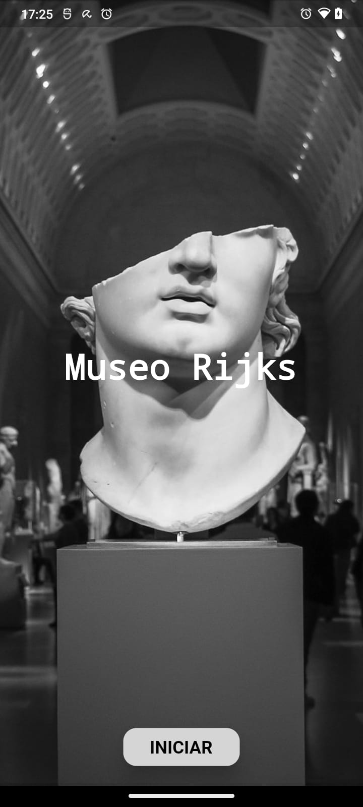
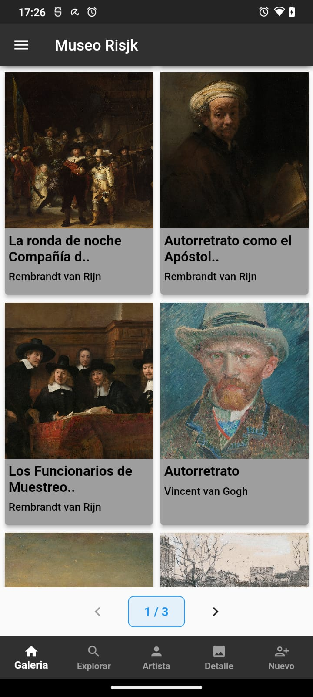
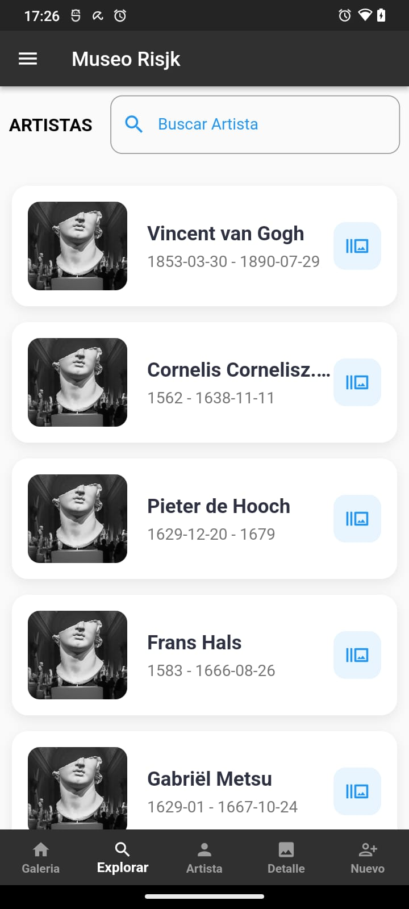
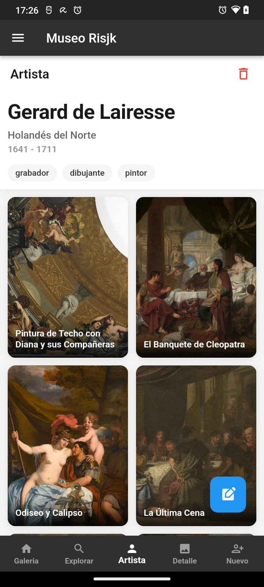
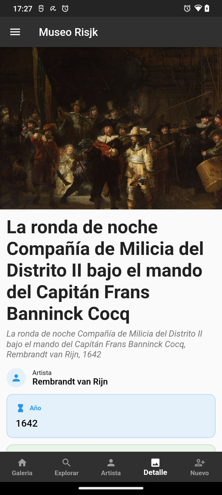
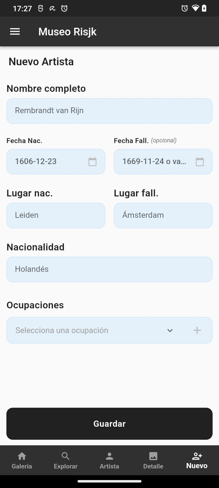

# Museo Rijks App

Aplicación desarrollada en Flutter para explorar obras de arte y artistas de un museo virtual. Permite visualizar colecciones, buscar artistas y gestionar información.

## Captura de pantallas

<table width="100%">
  <tr>
    <td align="center" width="33%">
      <br/>
      <b>Inicio</b>
    </td>
    <td align="center" width="33%">
      <br/>
      <b>Galeria Obras</b>
    </td>
    <td align="center" width="33%">
      <br/>
      <b>Listado Artistas</b>
    </td>
  </tr>
</table>

<table width="100%">
  <tr>
    <td align="center" width="33%">
      <br/>
      <b>Perfil de Artista</b>
    </td>
    <td align="center" width="33%">
      <br/>
      <b>Detalle De Obras</b>
    </td>
    <td align="center" width="33%">
      <br/>
      <b>Gestión Artista</b>
    </td>
  </tr>
</table>

## Características Principales

### Galería de Obras:

> - Muestra todas las obras de arte disponibles en el museo.
> - Permite hacer ver en pantalla completa cada imagen.
> - Permite reedirigir y ver los detalles de cada obra.

### Listado de Artistas:

> - Lista completa de artistas.
> - Buscador integrado para filtrar por nombre.
> - Permite navegación al perfil de cada artista.

### Perfil de Artista:

> - Información biogradfica del artista.
> - Lista de obras del artista seleccionado.
> - Opciones para edita o eliminar.

### Detalles de Obra:

> - Vista ampliada con información completa de cada obra.

### Gestión de Artistas:

> - Formulario para crear y actualizar artistas (CRUD).

## Tecnologías y Dependencias

Flutter: Framework de desarrollo de aplicaciones móviles multiplataforma.
La aplicación utiliza las siguientes dependencias principales:

```
dependencies:
  flutter:
    sdk: flutter
  cupertino_icons: ^1.0.2
  http: ^1.1.0                 # Peticiones HTTP
  flutter_dotenv: ^5.1.0       # Gestion variables de entorno
  provider: ^6.1.1             # Gestión de estado
```

## Intalación y Configuración

## Prerrequisitos

- Flutter SDK (versión 3.0 o superior)
- Dart SDK (versión 3.0 o superior)
- Android Studio / VS Code
- Dispositivo físico o emulador

## Pasos de Instalación

### 1 Clonar el repositorio:

```
git clone https://github.com/SilvaMauricioN/APP-FLUTTER-2.0.git
code APP-FLUTTER-2.0
```

### 2 Instalar dependencias:

```
flutter pub get
```

### 3 Configurar variables de entorno:

- Crea un archivo .env en la raíz del proyecto
- Edita el archivo .env con tus configuraciones

```
API_BASE_URL=https://museo-dwgk.onrender.com/api/museorijks
API_KEY=tu_api_key_aqui

```

- Variables requeridas:

> - API_BASE_URL: URL base de la API del museo
> - API_KEY: Clave de autenticación para la API

### 4 Ejecutar la aplicación:

```
flutter run

```

## API del Museo Rijks

La aplicación utiliza la api del Museo Rijks, para obtener información sobre las obras de arte. Puedes encontrar más información sobre la API en la siguiente dirección: https://museo-dwgk.onrender.com
